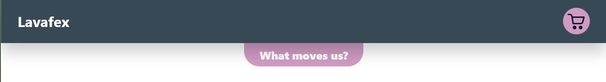
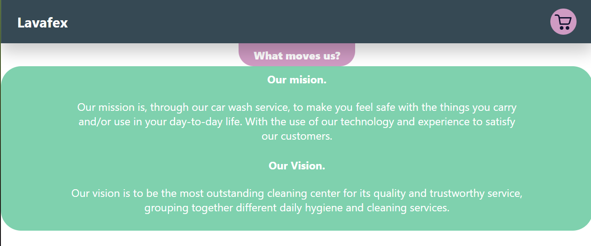
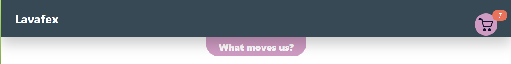
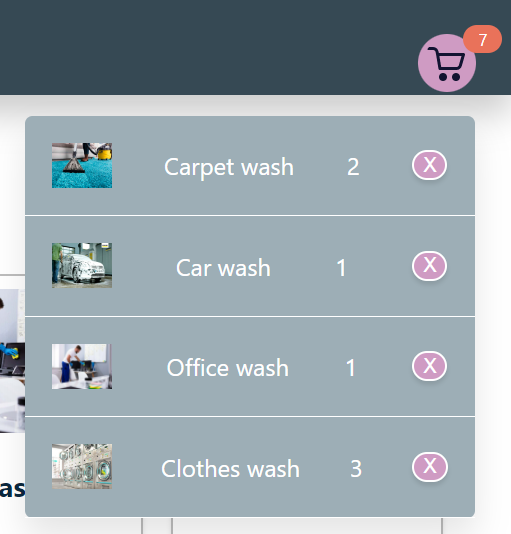
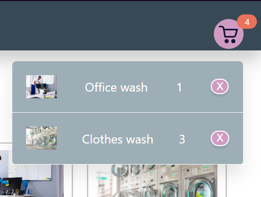
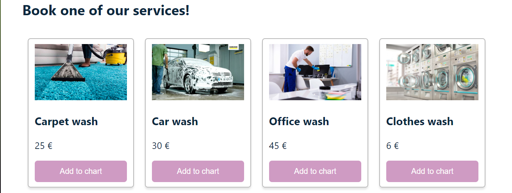

## College assignment Lavafex.

This project was bootstrapped with [Create React App](https://github.com/facebook/create-react-app).

# General description.

This page was developed with the aim of practicing my skills
developing with `React.js`; The theme was inspired by a work assignment
in one of the university courses, although it was not part of the requirements
for this one.
A carpet laundry was looking to resurface after a period of poor
management by the manager in charge and one of our measures was
creating a better online presence, which led me to this project.

## Elements:
  - Navbar.
    - Chart
    - Values tab.
  - Services deck.
  - Footer.

# Navbar.

The navigation bar only has 3 simple elements: a logo in letters,
a button on the values ​​of the company, a cart icon with the services
that you want to hire.

  - ## Values tab.

  When pressing the lower tab of values, a box is displayed
  that shows the mission and vision of the company which will be shown in
  a later image; This same hidden tab
  the window again when interacting.

  Once you use the values ​​tab found on the bottom
  bottom, a window like the following is displayed.

  

  - ## Chart.

  The car is represented as follows, it has a red bubble that indicates the amount of selected services further down the page. keep an account
  detailed from 1 to 9, above this the account only shows a
  "9+". For the example, 7 selected elements are shown.

  

    - ### Delete function.

    Each item in this list has a purple button on the far right
    with an "X". This calls a function that eliminates per unit
    each time it is interacted with, once the number of items
    reaches 0 the service is removed from the cart.

    The following images show how the content looks
    of the cart before and after using the button a couple of times before
    mentioned.

    
    

# Services.

Here you can see a representation of how the services are arranged
that "Lavafex" offers (based on the work that was done as a team in
lessons).

Each service is available to the client in the form of a card, these contain:
  - Representative photo of the service.
  - Service name.
  - "Add to cart" button, it is by interaction with this that
    elements are added in unit quantities to the
    cart previously shown in this document.

    

# Footer.

At the end of the page a generic footer is shown with the name of the person
wrote this document, plus a mention to `create-react-app`.

  
I consider that although I can continue developing extra features for the page, it is a simple development exercise to measure my abilities for this type of work.

Thanks so much for reading.
